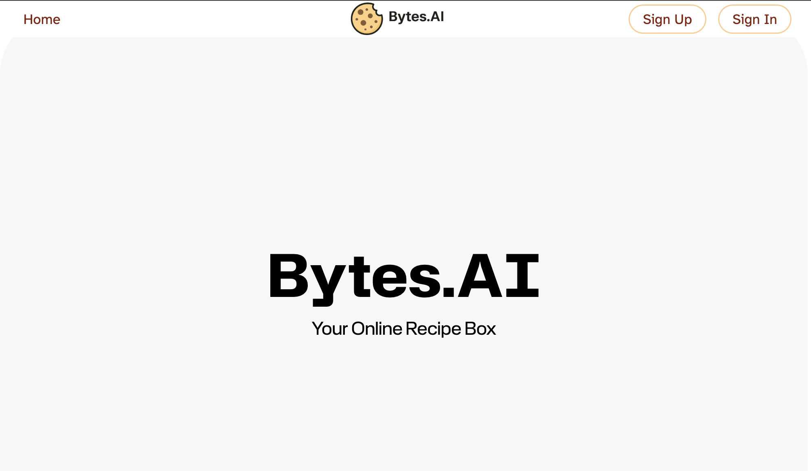

# Bytes.AI



This is the front-end repo for Bytes.AI, a full-stack online recipe box. Users can save their recipes, use the built-in AI to generate recipes, add ingredients to a grocery list, and spin a wheel to decide what to cook if you're not sure!

🖥️ Backend Repository: [Bytes.AI Backend](https://github.com/saramattina/bytes-backend/tree/main)

## 🟢 Getting Started

### ✅ Pre-requisites

- Node.js & npm
- React RESTful API (Vite)
- A running instance of [Bytes.AI Backend](https://github.com/saramattina/bytes-backend/tree/main)

### ⚙️ Installation

1. Fork and Clone the Repo

```
git clone <repo>
cd <cloned repo>
```

2. Install Dependencies
```
npm install

```

3. Create .env File

Create a .env file and link to your backend API
```
VITE_BACK_END_SERVER_URL= <your-backend-url-here>
```

4. Start Your Server
```
npm run dev
```

## 💻 Technologies Used

- Node.js & npm
- React (Vite)
- CSS / Flexbox / Grid

## 🌱 Stretch Goals
- AAU, I'd like to have this be an app to download to my phone

## ✍️ Editor’s Note
> The **Bytes.AI Frontend** is the engine that powers a smarter way to cook — blending creativity, collaboration, and AI.
> This project reflects our shared goal of building technology that feels **helpful, elegant, and human**.
> From scalable React architecture to AI-driven recipe generation, every component was crafted with care, curiosity, and hunger.


## 🤝 Contributors

| Name                                                | Role                                       |
| --------------------------------------------------- | ------------------------------------------ |
| **[Daniel Amit](https://github.com/DanielAmit217)** | Project Manager · Full-Stack & AI Engineer |
| **[Sara Mattina](https://github.com/saramattina)**  | Front-End Engineer · Repository Owner      |
| **[Dylan Tai](https://github.com/DylanTai)**        | Back-End Engineer · Repository Owner       |

💡 _Team Bytes.AI — fueled by innovation, caffeine, and clean commits._